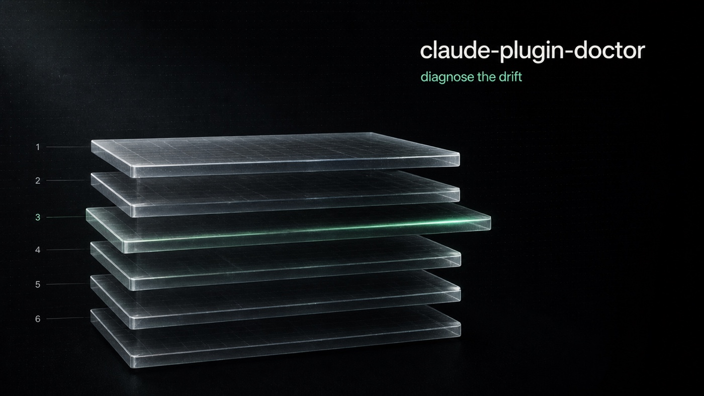

# claude-plugin-doctor



[](https://github.com/yaniv-golan/claude-plugin-doctor/actions/workflows/ci.yml)
[](https://www.npmjs.com/package/claude-plugin-doctor)
[](https://www.npmjs.com/package/claude-plugin-doctor)
[](LICENSE)
[](.nvmrc)
[](#platform-support)
[](https://github.com/yaniv-golan/skill-creator-plus)

> Diagnose drift across the six cache layers of the Claude Code / Claude Desktop plugin system, and recommend the minimum-impact fix.

## Why

A plugin author bumps a marketplace, hits Refresh, hits Update — and Claude is still loading the old skill. The reason: the plugin system has **six independent cache layers**, and any one of them can be stale on its own. `cpd` walks every layer, computes the drift, and tells you the smallest action that fixes it.

The six layers:

1. Marketplace clone (`marketplaces/<mp>/`)
2. Plugin install snapshot (`cache/<mp>/<plugin>/<version>/`)
3. Claude Cowork session mirror (per-account/org)
4. Backend remote marketplace catalog
5. Cowork in-app install — "Personal plugins" (`<userData>/.../rpm/`)
6. Standalone Claude Code remote SSH content-hash sync

See the [Architecture & Design Gist](https://gist.github.com/yaniv-golan/6c95c08aba98fc8218ef13e99461822f) for the full design, or run `cpd explain` for the in-tool cheat-sheet.

## Install

### CLI (always required)

```bash
npm i -g claude-plugin-doctor
# or run without installing
npx claude-plugin-doctor
```

Aliased binary: `cpd`. Requires Node 20+.

### Claude Code / Cowork plugin (optional, recommended)

Installing the bundled plugin gives Claude Code and Claude Cowork agents a skill that auto-triggers on plugin-staleness symptoms (e.g. "claude plugin update says already at latest version") and drives `cpd` for you. The plugin requires `cpd` on PATH — install the CLI above first.

```bash
# Add the marketplace
claude plugin marketplace add yaniv-golan/claude-plugin-doctor

# Install the plugin
claude plugin install claude-plugin-doctor@cpd
```

Or, from inside a Claude Code session:

```text
/plugin marketplace add yaniv-golan/claude-plugin-doctor
/plugin install claude-plugin-doctor@cpd
```

### Platform support

`cpd` is **macOS-only**. Linux and Windows currently exit with `E_PLATFORM_UNSUPPORTED`. Linux support is on the roadmap; Windows is later.

## What it looks like

A full scan summarizes drift across every discovered root and emits an ordered fix list:

```text
$ cpd

✗ Drift detected — 2 fixes available below  (manual action required)

Topology:
  Standalone Claude Code         ~/.claude/plugins
                                 3 marketplace(s)
  Claude Cowork (active)         ~/Library/Application Support/Claude/.../<acc>/<org>
                                 2 marketplace(s)

Drift summary:
  Marketplaces      1 stale
  Plugins           3 affected (2 stale, 1 registration mismatch)
  Surfaces          1 change needs a new task or app restart to take effect

Recommended actions, in order:
  1. claude plugin marketplace update acme-marketplace
     fixes: marketplace clone behind remote (acme-marketplace)
  2. (manual)  Bump plugin.json#version in my-dev-plugin's source repo, commit, push, then refresh + update.
     For per-plugin step-by-step:
       cpd check my-dev-plugin@local-mp

After fixes:
  ⚠ Restart Claude Desktop for config changes to take effect.

Exit code: 3  (drift detected, manual action required)
```

For a single-plugin deep-dive:

```text
$ cpd check transcription-reader@transcription-reader-marketplace

Plugin:        transcription-reader@transcription-reader-marketplace  (in standalone Claude Code)
Source:        https://github.com/.../transcription-reader-skill.git (git)
Installed:     0.3.0  (scope=user)
               commit  ca7cdf74bfb7
               last update  2026-05-03 (~21 hrs ago)

Fix:
  claude plugin update transcription-reader@transcription-reader-marketplace

Marketplace clone (transcription-reader-marketplace)
  ✓ fresh — Local clone matches remote HEAD (918b0ea).

Plugin install on disk
  ⚠ stale — Stale install — plugin.json has 0.4.0, you have 0.3.0
       installed       0.3.0  (commit ca7cdf7)
       plugin.json     0.4.0
       fix             claude plugin update

Other caches       not applicable here (Cowork session mirror, Cowork in-app install, remote SSH cache, backend marketplace catalogue (server-side, no local cache))

Exit code: 2  (drift detected, fixes available)
```

## Usage

```bash
cpd                                          # full scan (default subcommand)
cpd check <plugin>@<mp>                      # single-plugin deep dive
cpd refresh <mp>                             # claude plugin marketplace update + diff
cpd refresh <mp> --force-fetch --yes         # bypass for the silent-cooldown bug (#46081)
cpd refresh <mp> --auto-update               # also run `claude plugin update` for stale plugins
cpd list                                     # inventory
cpd explain                                  # architecture cheat-sheet + status legend
cpd topology                                 # show discovered installation layout (debug)
cpd verify-in-ui <plugin>@<mp>               # capture what Claude Desktop's UI shows
cpd watch <plugin>@<mp>                      # file-watcher dev loop (macOS)
cpd cache --orphans                          # list unreferenced install-snapshot dirs
cpd cache --prune-cowork-sessions [-y]       # reclaim stale session-local dirs
```

Common flags (run `cpd --help` for the full list):

```bash
--json                                       # machine-readable output (any subcommand)
--ndjson-events [--events-file <path>]       # stream phase events to stderr or a file
--no-network                                 # offline mode (skip git ls-remote and HTTP fetches)
--mode <all|ccd|cowork|auto>                 # default: all (walks every root)
--root <accId:orgId>                         # filter multi-root scan to a specific cowork root
--max-concurrency <n>                        # cap parallel upstream probes (default: 8)
--log-file <path> | --no-log-file
-v, --verbose                                # stream per-event prose to stderr
-q, --quiet                                  # silence progress and human report
```

Probably the most useful feature for plugin authors: `cpd check` detects the **silent no-op update** — when you've been editing and pushing without bumping `plugin.json#version`, so `claude plugin update` does nothing — and prints the exact bump-and-republish steps to fix it.

By default `cpd` writes a detailed NDJSON log to `~/.claude-plugin-doctor/logs/cpd-<timestamp>.log`. `tail -f` it for live debugging. Override with `--log-file <path>` or disable with `--no-log-file`.

For AI agents and scripts, the **stable contract** lives in [`docs/CLI-DESIGN.md`](docs/CLI-DESIGN.md): JSON schema, exit codes, error codes, NDJSON event stream, and stability policy. For "what does this drift kind mean and how do I fix it?", see [`docs/TROUBLESHOOTING.md`](docs/TROUBLESHOOTING.md).

## Documentation

| Doc | What it covers |
|---|---|
| [`docs/CLI-DESIGN.md`](docs/CLI-DESIGN.md) | Stable JSON / exit-code / NDJSON contract for scripts and AI agents. |
| [`docs/TROUBLESHOOTING.md`](docs/TROUBLESHOOTING.md) | Field guide to every drift kind `cpd` reports and how to fix it. |
| [`docs/anthropic-issue-map.md`](docs/anthropic-issue-map.md) | Which Anthropic GitHub issues each cache layer addresses. |
| [`skills/claude-plugin-doctor/SKILL.md`](skills/claude-plugin-doctor/SKILL.md) | Agent skill bundled with the plugin — how Claude Code / Cowork drives `cpd` for you. |
| [Architecture & Design Gist](https://gist.github.com/yaniv-golan/6c95c08aba98fc8218ef13e99461822f) | Canonical reference for the six-layer model. |
| `cpd explain` | In-tool architecture cheat-sheet and status legend. |

## Why not just `claude doctor` or `claude plugin validate`?

- `claude doctor` only checks the Claude CLI auto-updater, not plugins.
- `claude plugin validate` only checks a single manifest's schema, not cross-layer state.
- Anthropic [Issue #48675](https://github.com/anthropics/claude-code/issues/48675) requests a `/plugin doctor` — until that ships, no purpose-built diagnostic exists.

## Status

`0.1.0` — initial public release. macOS only. See [`CHANGELOG.md`](CHANGELOG.md).

## Contributing

See [`CONTRIBUTING.md`](CONTRIBUTING.md). PRs welcome. Bugs and feature requests via the [issue templates](https://github.com/yaniv-golan/claude-plugin-doctor/issues/new/choose).

## License

[MIT](LICENSE)
